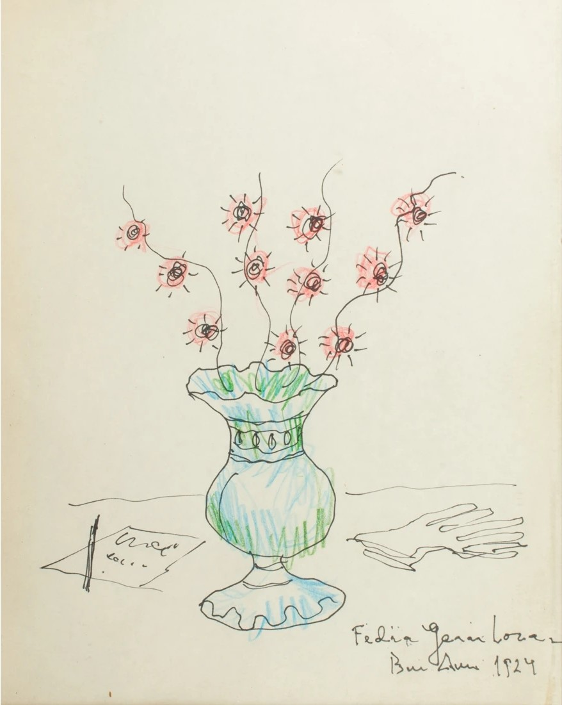

# Libro de Poemas 詩篇

## 目錄

- 前言
- [Veleta 風向標](../../posts/veleta-lorca) 
- [Canción otoñal 秋歌](../../posts/cancion-otonal-lorca) 
- [Canción primaveral 春歌](../../posts/cancion-primaveral-lorca) 
- [Canción menor 短歌](../../posts/cancion-menor-lorca) 
- [La sombra de mi alma 我靈魂的陰影](../../posts/la-sombra-lorca) 
- [Si mis manos pudieran deshojar 如果我的雙手能夠撥開](../../posts/si-mis-manos-lorca) 
- [Hay almas que tienen 有些靈魂具有……](../../posts/hay-almas-lorca) 
- [Deseo 願望](../../posts/deseo-lorca) 
- [Horas de estrellas 星時辰](../../posts/horas-de-estrellas-lorca) 
- [TBC](../../posts/) 

---

